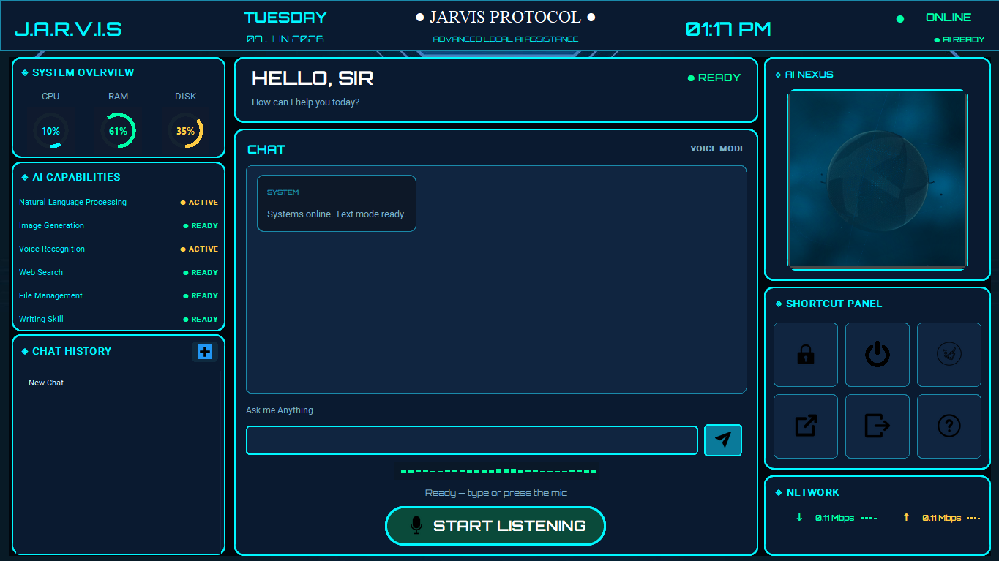
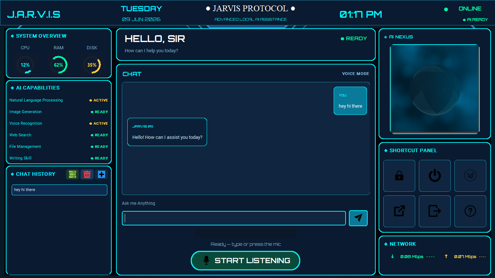
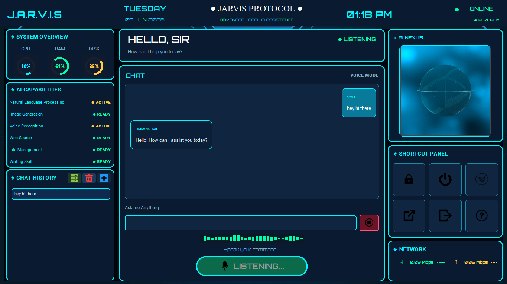

<div align="center">
  
  <h1>J.A.R.V.I.S AI Assistant</h1>
  <p><b>Just A Rather Very Intelligent System</b></p>
  <p><i>Your Personal AI-Powered Desktop Assistant for Windows</i></p>

  <p>
    
    
    
    
    
  </p>

  <p>
    <a href="#features">Features</a> •
    <a href="#screenshots">Screenshots</a> •
    <a href="#quick-start">Quick Start</a> •
    <a href="#changelog">Changelog</a> •
    <a href="#security">Security</a> •
    <a href="#license">License</a> •
    <a href="#contact">Contact</a>
  </p>

  <p>
    🌐 <a href="https://codebyshahil.github.io/JARVIS-AI-WEBSITE/"><b>Visit Official Website</b></a>
  </p>

  <br>

  

  <br>
</div>

---

## Overview

J.A.R.V.I.S is a **commercial desktop AI voice assistant** for Windows that runs **fully offline** using local LLM inference. No cloud APIs, no data collection, no subscriptions — just a powerful, private AI assistant on your machine.

It combines natural voice conversations with deep system automation, web tools, productivity features, and a stunning futuristic interface.

---

## Features

<details open>
<summary><b>Artificial Intelligence</b></summary>
<br>

- AI-powered natural conversations
- 5-layer NLU engine (lexical, syntactic, semantic, discourse, pragmatic)
- Context-aware responses with session memory
- Local inference via local LLM (Ollama compatible)
- No cloud dependency — 100% private
- Smart command processing and intent classification
- AI writing assistant (essays, poems, letters, stories)
- Image generation via airforce API with model fallback
</details>

<details>
<summary><b>Voice Assistant</b></summary>
<br>

- Real-time speech recognition
- Hands-free voice commands
- Wake word detection
- Text-to-speech with natural voices
- Voice volume and rate control
- Continuous listening mode
</details>

<details>
<summary><b>System Automation</b></summary>
<br>

- Open/close applications and websites
- Volume control (up, down, mute)
- Lock, shutdown, restart, sleep PC
- Battery monitoring and system info
- Brightness control
- Clipboard management
- Screen recording and screenshot capture
- Connected devices scanning
- Wallpaper changer
- WiFi and network management
</details>

<details>
<summary><b>Internet Tools</b></summary>
<br>

- Web search and information retrieval
- Weather forecasts
- News headlines
- Wikipedia lookups
- Language translation
- Currency conversion
- Network speed test
- IP address and network info
</details>

<details>
<summary><b>Productivity</b></summary>
<br>

- Smart notes with file I/O
- Mathematical calculations
- Alarms and timers
- Reminders
- Calendar date queries
- Writing assistant
- Quick launch commands
</details>

<details>
<summary><b>Interface</b></summary>
<br>

- CustomTkinter modern UI framework
- 3D AI Nexus Orb visualization (Three.js in WebView2)
- Interactive chat panel with sessions
- Chat history with editing and export
- Futuristic cyberpunk design language
- Smooth animations and transitions
- Dark theme optimized for low eye strain
</details>

---

## Screenshots

<div align="center">
  <table>
    <tr>
      <td></td>
      <td></td>
    </tr>
    <tr>
      <td><b>Main Dashboard</b></td>
      <td><b>AI Chat Interface</b></td>
    </tr>
    <tr>
      <td></td>
      <td></td>
    </tr>
    <tr>
      <td><b>Voice Assistant</b></td>
      <td><b>System Dashboard</b></td>
    </tr>
  </table>
</div>

---

## Quick Start

### System Requirements

| Component | Minimum | Recommended |
|-----------|---------|-------------|
| **OS** | Windows 10 | Windows 11 |
| **RAM** | 4 GB | 8 GB+ |
| **Storage** | 2 GB free | SSD, 4 GB+ free |
| **Network** | Internet (initial setup) | Stable broadband |
| **Audio** | Speakers | Microphone + Speakers |
| **AI** | Local LLM (optional) | GPU with 4 GB+ VRAM |

### Installation

1. **Purchase a license** and download the latest `J.A.R.V.I.S_v1.0.0.exe`
2. **Run** `J.A.R.V.I.S.exe`
3. **Enter** your license key
4. **Start** using your AI assistant

> The full detailed guide is available in the [User Manual](https://codebyshahil.github.io/JARVIS-AI-WEBSITE/jarvis_help.html).

---

## Why J.A.R.V.I.S?

| Capability | J.A.R.V.I.S | Other Assistants |
|------------|-------------|-------------------|
| AI Chat | :white_check_mark: | :warning: Limited |
| Offline AI (Local LLM) | :white_check_mark: | :x: Cloud-only |
| Voice Commands | :white_check_mark: | :warning: Basic |
| PC Automation | :white_check_mark: | :x: |
| Modern UI | :white_check_mark: | :warning: |
| No Telemetry | :white_check_mark: | :x: |
| Single Purchase | :white_check_mark: | Subscription |
| 3D Visualization | :white_check_mark: | :x: |

---

## Architecture

```
┌─────────────────────────────────────────────────┐
│                   User Input                     │
│          (Voice / Text / Keyboard)               │
└──────────────────────┬──────────────────────────┘
                       │
┌──────────────────────▼──────────────────────────┐
│              Speech Recognition                  │
│              (SpeechRecognition)                 │
└──────────────────────┬──────────────────────────┘
                       │
┌──────────────────────▼──────────────────────────┐
│           5-Layer NLU Engine                     │
│  Lexical → Syntactic → Semantic → Discourse → Pragmatic │
└──────────────────────┬──────────────────────────┘
                       │
┌──────────────────────▼──────────────────────────┐
│           Intent Classifier                      │
│  ┌──────┐  ┌──────┐  ┌──────┐  ┌──────┐       │
│  │ AI   │  │Voice │  │System│  │ Web  │       │
│  │Chat  │  │Admin │  │Ctrl  │  │Tools │       │
│  └──┬───┘  └──┬───┘  └──┬───┘  └──┬───┘       │
│  ┌──▼───┐  ┌──▼───┐  ┌──▼───┐  ┌──▼───┐       │
│  │Ollama│  │TTS   │  │PyAuto│  │Reqs  │       │
│  │LLM   │  │Engine│  │GUI   │  │/API  │       │
│  └──────┘  └──────┘  └──────┘  └──────┘       │
└──────────────────────┬──────────────────────────┘
                       │
┌──────────────────────▼──────────────────────────┐
│               Output Handler                     │
│    Text Response / Voice Reply / Action Executed │
└─────────────────────────────────────────────────┘
```

---

## Documentation

| Resource | Link |
|----------|------|
| **Official Website** | [codebyshahil.github.io/JARVIS-AI-WEBSITE](https://codebyshahil.github.io/JARVIS-AI-WEBSITE/) |
| **User Manual** | [Open Guide →](https://codebyshahil.github.io/JARVIS-AI-WEBSITE/jarvis_help.html) |
| **Quick Start Guide** | See above |
| **Command Reference** | Included in the application |

---

## Pricing

<div align="center">

### ₹ **499** — Personal License

*One-time purchase. Lifetime access. No subscriptions.*

| Included | Details |
|----------|---------|
| Full Software Access | All features unlocked |
| AI & Voice Assistant | Full capability |
| System Automation | All automation tools |
| Future Updates | v1.x updates included |
| Technical Support | Email support |
| License Term | Lifetime |

</div>

### Activation

1. Launch J.A.R.V.I.S
2. Enter your License Key
3. Activate online (one-time)
4. Start using J.A.R.V.I.S

---

## Technologies

<div align="center">

| Category | Technology |
|----------|------------|
| **Language** | Python 3.10+ |
| **UI Framework** | CustomTkinter |
| **AI Inference** | Local LLM (Ollama compatible) |
| **Voice Input** | SpeechRecognition |
| **Voice Output** | pyttsx3 / TTS |
| **Desktop Automation** | PyAutoGUI |
| **3D Visualization** | Three.js (WebView2) |
| **Packaging** | PyInstaller |
| **Imaging** | Pillow, OpenCV |
| **Networking** | Requests, BeautifulSoup |
| **System** | psutil, pycaw, wmi |

</div>

---

## Security & Privacy

- **100% Local AI**: All conversations processed locally on your machine
- **No Telemetry**: Zero data collection or usage analytics
- **No Cloud Dependency**: Core features work fully offline
- **Environment Config**: Sensitive settings via env vars, never hardcoded
- **Secure Activation**: License key validation with offline fallback
- **Encrypted Storage**: Chat history and notes stored securely

For more details, see [SECURITY.md](SECURITY.md).

---

## Changelog

See [CHANGELOG.md](CHANGELOG.md) for a full list of releases, features, and fixes.

---

## License

**Commercial Software** — All Rights Reserved.

This project is **not open source**. A purchased Personal License grants the
right to install and use the software on personal devices. See the
[LICENSE](LICENSE) file for full terms.

:no_entry: Redistribution, modification, resale, and reverse engineering are
strictly prohibited.

---

## Contact

<div align="center">

**Shahil** — Creator & Developer

:email: **parwezshahil4@gmail.com**

:globe_with_meridians: **Website**: [codebyshahil.github.io/JARVIS-AI-WEBSITE](https://codebyshahil.github.io/JARVIS-AI-WEBSITE/)

:books: [User Manual](https://codebyshahil.github.io/JARVIS-AI-WEBSITE/jarvis_help.html)

---

<p>Built with Python &hearts; Designed for Windows &hearts; Powered by AI</p>

</div>
